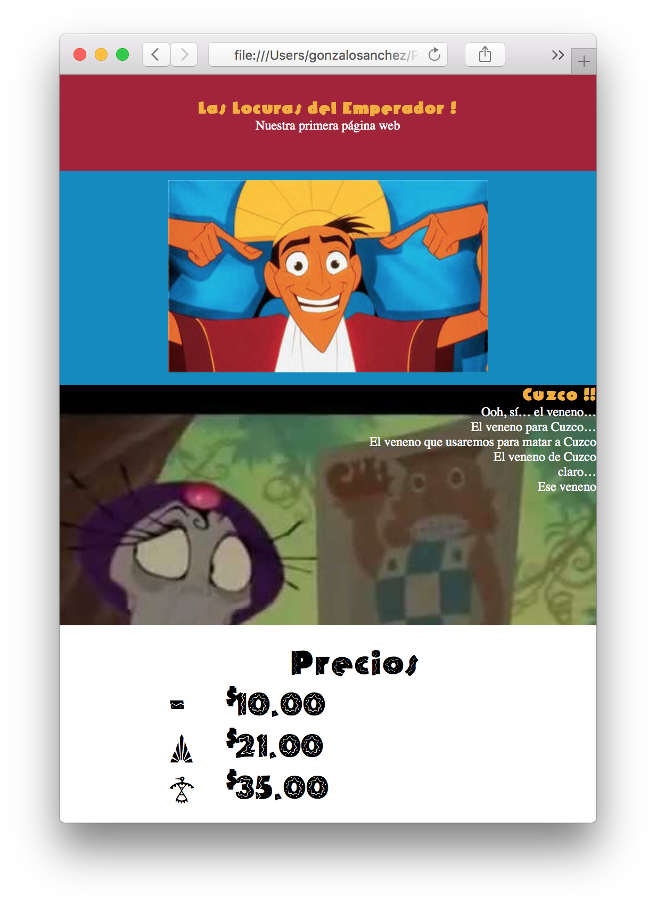

## Actividad 002 - HTML / CSS

Se pide armar el HTML y CSS para construir una página web como la de la siguiente imagen.

Tips para construir el sitio:

Fíjate en las secciones, ¿cúantas son?, crea la estructura del HTML y luego agrega las secciones.

Con el armado listo agrega el contenido de todas las secciones y la imagén en la segunda sección.

Utilizando CSS (en lo posible en el HEAD) da el tamaño de las secciones.

Utilizando CSS alínea los textos, y agrega la foto de fondo en la tercera sección.

Finalmente busca la tipografía y agrega a las cabeceras correspondiente.
